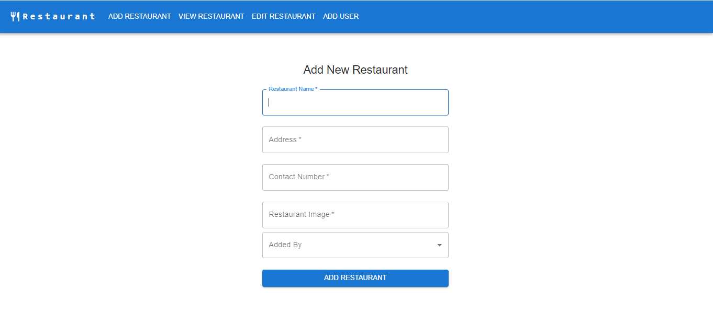
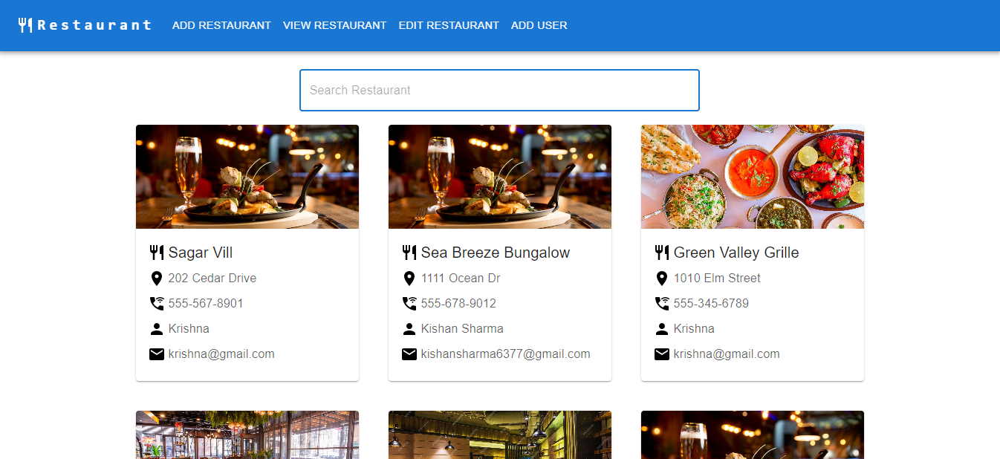
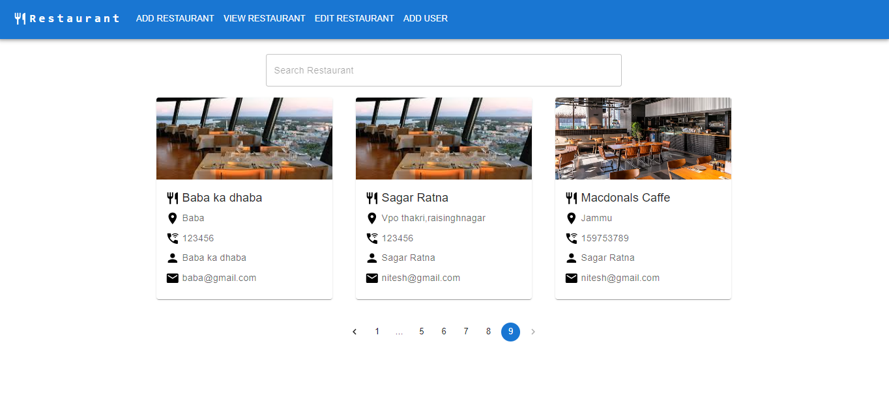
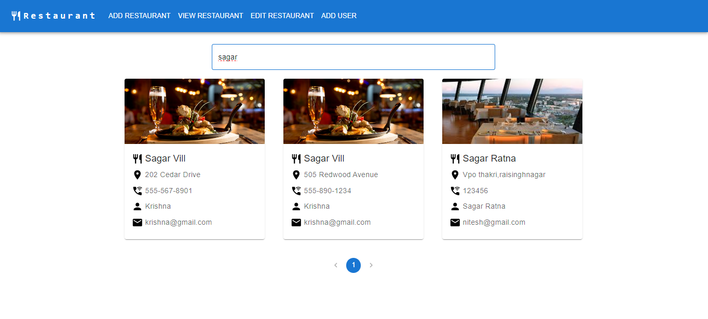
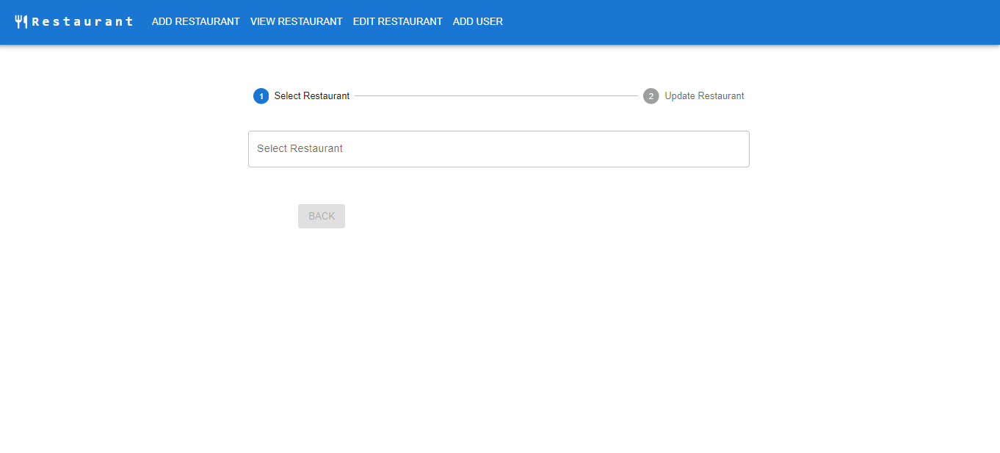
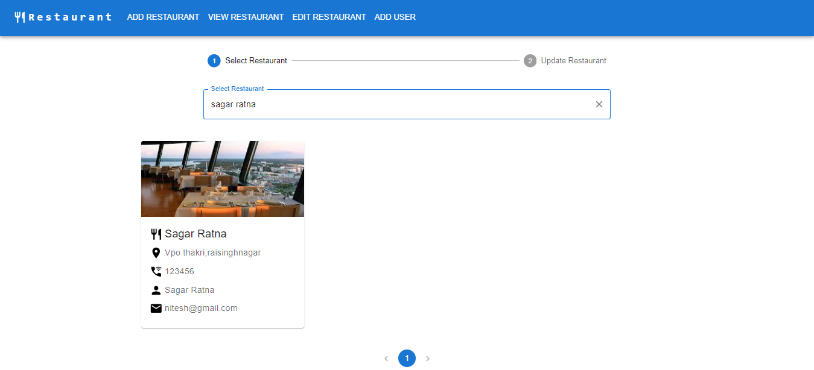
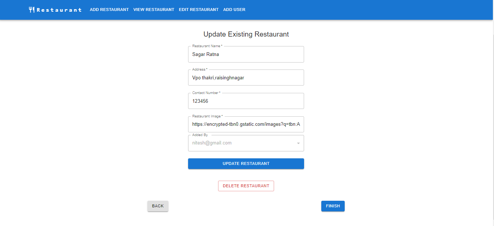
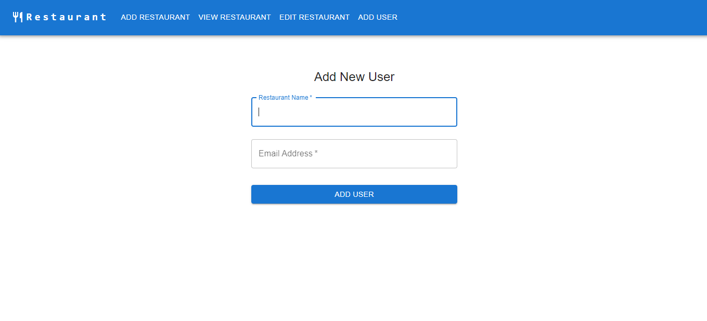

# Dine-Hub

### Description

The Dinehub App is a web application built to manage and display information about various restaurants. It provides features such as adding new restaurants, editing restaurant details, deleting restaurants, and viewing a list of all restaurants along with user information who owns it. The app is built using a combination of React and Node.js, with a MySQL database to store restaurant data.

## Table of Contents

-   Features
-   Tech Stack
-   Getting Started
    - Prerequisites
    - Installation
-   Usage
-   Project Structure
-   Deployement
-   Contributing
-   License

## Features

-   **Add New Restaurant** : Users can add new restaurants to the database, including restaurant name, location, owner email, and other relevant information.

-   **Edit Restaurant Details** : Existing restaurant details can be updated, allowing users to modify information such as the restaurant's name, address, or contact etc.

-   **Delete Restaurants** : Restaurants can be removed from the database if they are no longer relevant.

-   **View All Restaurants** :  Users can effortlessly explore a rich database of restaurants, refining searches by name or location. Integrated pagination ensures a seamless browsing experience.

-   **User Management** : Easily add users along with their associated restaurant names, edit user information, and delete users as needed.

## Tech Stack
-   **Frontend** :
    - React
    - Material UI
    - Redux for state management
    - React hooks (useState, useEffect, useSearchParams, useLocation etc.)

-   **Backend** :
    - Node.js
    - Express.js for building the API
    - Sequelize as the ORM (Object-Relational Mapping)
    - MySQL as the backend database

## Getting Started

-   Follow these instructions to set up and run the project on your local machine.

-   **Prerequisites**

    - Node.js and npm installed
    - MySQL database server
    - Git 

-   **Installation**

    - Clone the repository : ***git clone https://github.com/Niteshthori24198/DineHub***
    - Navigate to the project directory : **cd restaurant_listing_app**
    - Install frontend dependencies : ***npm install***
    - Install backend dependencies : ***npm install***
    - Configure the database connection in the server configuration files.
    - Run the development server for the frontend and backend separately :
        - FrontEnd : ***npm start***
        - BackEnd : ***npm start***

## Usage

-   Visit the app in your web browser.
-   Use the navigation and user interface to add, edit, delete, and view restaurant listings.

-   Snapshots of the App is attached below.

### Home Page

### Add New Restaurant Page

### Restaurant Page

### Edit Restaurant Page

### User Page

## Project Structure

-   **Restaurant_App** : Contains the frontend React application.
-   **Backend** : Contains the backend Node.js and Express application.
-   **Database** : Includes scripts and migrations for setting up and managing the MySQL database.
-   **Config** : Configuration files for both frontend and backend.
-   **Public** : Public assets and Material UI template for the frontend.

## Deployement

-   **Backend API Link** :- 
***https://restaurant-listing-app-niteshthori24198.vercel.app/***

-   **Frontend Link** :-
***https://restaurant-app-niteshthori24198.vercel.app/***

## Contributing

-   Contributions are welcome! Feel free to enhance our project by submitting your ideas, bug fixes, or new features through pull requests.

## License

-   This project is licensed under the MIT License - see the LICENSE file for details.
